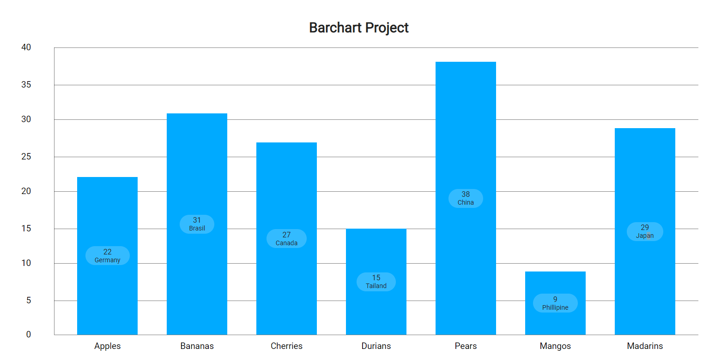
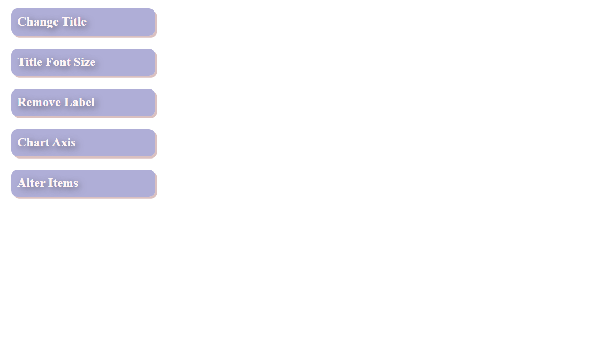
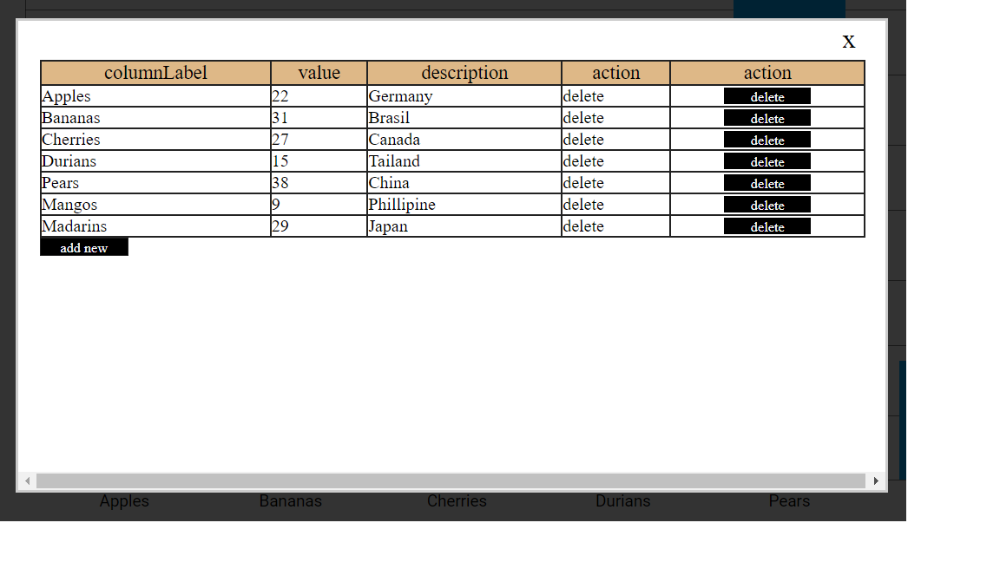

# Bar Chart Project

### Barchart Overview

### Menu

### Alter Bar Page

* This app allows user to build and customize a bar chart and render it into the browser

* The Bar Chart Project is a stretch project in the prep work done for LightHouse Lab BootCamp.

* The purpose of the project is to practice responsive design, problem solving, HTML, CSS, jQuery, Javascript, and learning and using new libraries

## Feature
* Users can customize the following in the UI:
  1) Title
  2) Title Font Size
  3) Remove / Add Label
  4) Chart Axes Format
  5) Alter Items

* In addition, users can also:
  1) Add New Bar in The Chart
  2) Delete Certain Bar
  3) Update Details Of The Bar
  

## Technical Information / Stack
* HTML
* JavaScript
* CSS
* jQuery

## Getting Started
1) Clone the repository
2) Open script.js
3) Modify the data, option, and element parameters to customize the bar chart to your liking 
4) Open index.html to view it and further customize the bar chart with the UI provided
